# Database Schema Documentation

**Database:** PostgreSQL  
**ORM:** Prisma  
**Total Tables:** 33

---

## Table of Contents

1. [Enums](#enums)
2. [Core Tables](#core-tables)
3. [Freelancer Tables](#freelancer-tables)
4. [Project Tables](#project-tables)
5. [Business Request Tables](#business-request-tables)
6. [Communication Tables](#communication-tables)
7. [Payment Tables](#payment-tables)
8. [System Tables](#system-tables)
9. [Entity Relationship Diagram](#entity-relationship-diagram)

---

## Enums

### Role
```typescript
enum Role {
  CLIENT
  ADMIN
  MODERATOR
  FREELANCER
}
```

### KPIRANK
```typescript
enum KPIRANK {
  BRONZE
  SILVER
  GOLD
  PLATINIUM
  DIAMOND
  CROWN
  ACE
  CONQUERER
}
```

### PROJECT_STATUS
```typescript
enum PROJECT_STATUS {
  CANCELLED    // project has been cancelled
  PENDING      // no one has accepted the project yet
  ONGOING      // someone is working on it
  COMPLETED    // progress percentage is 100%
}
```

### DIFFICULTY_LEVEL
```typescript
enum DIFFICULTY_LEVEL {
  EASY
  MEDIUM
  HARD
}
```

### PROJECT_TYPE
```typescript
enum PROJECT_TYPE {
  INHOUSE
  OUTSOURCE
}
```

### consultationStatus
```typescript
enum consultationStatus {
  PENDING
  ACCEPTED
  REJECTED
}
```

### PaymentStatus
```typescript
enum PaymentStatus {
  PENDING
  SUCCEEDED
  FAILED
  CANCELED
  REFUNDED
}
```

### PaymentMethod
```typescript
enum PaymentMethod {
  CARD
  BANK_TRANSFER
  WALLET
}
```

---

## Core Tables

### User
Primary user table for authentication and user management.

| Field | Type | Attributes | Description |
|-------|------|------------|-------------|
| uid | String | @id, @default(cuid()) | Primary key |
| username | String | @unique | Unique username |
| fullName | String | | Full name of user |
| email | String | @unique | Unique email |
| password | String | | Hashed password |
| role | Role | @default(CLIENT) | User role |
| otpPassword | String? | @unique | OTP for verification |
| giveModeratorFullAccess | Boolean | @default(false) | Moderator permissions |
| otpPasswordExpiry | DateTime? | | OTP expiration time |
| emailVerifiedAt | DateTime? | | Email verification timestamp |
| phone | String? | @unique | Phone number |
| tokenVersion | Int | @default(0) | For JWT token invalidation |
| address | String? | | User address |
| detail | String? | | Additional details |
| portfolioUrl | String? | | Portfolio URL |
| niche | String? | | Specialization area |
| topProjects | String[] | @default([]) | Top projects array |
| kpi | Json[] | @default([]) | KPI metrics |
| kpiHistory | Json[] | @default([]) | Historical KPI data |
| kpiRank | KPIRANK | @default(BRONZE) | Current KPI rank |
| kpiRankPoints | Int | @default(0) | Rank points |
| trashedBy | String? | | Who trashed the user |
| trashedAt | DateTime? | | Trash timestamp |
| createdAt | DateTime | @default(now()) | Creation timestamp |
| updatedAt | DateTime | @updatedAt | Update timestamp |

**Relations:**
- `createdProjects` → Project[] (one-to-many)
- `projects` → Project[] (many-to-many - InterestedFreelancers)
- `selectedProjects` → Project[] (many-to-many - SelectedFreelancers)
- `interestedProjectBuilders` → ProjectBuilder[] (many-to-many)
- `selectedProjectBuilders` → ProjectBuilder[] (many-to-many)
- `projectRequests` → ProjectRequest[] (one-to-many)
- `payments` → Payment[] (one-to-many)

**Indexes:** uid, username, email, role, otpPassword, trashedAt, trashedBy

---

## Project Tables

### Project
Main project management table.

| Field | Type | Attributes | Description |
|-------|------|------------|-------------|
| id | Int | @id, @default(autoincrement()) | Primary key |
| title | String | @unique | Project title |
| projectSlug | String | @unique | URL slug |
| detail | String | | Project details |
| niche | String | | Project niche/category |
| bounty | Int | | Project reward amount |
| deadline | DateTime | | Project deadline |
| progressPercentage | Int | @default(0) | Progress (0-100) |
| difficultyLevel | DIFFICULTY_LEVEL | @default(EASY) | Difficulty level |
| projectStatus | PROJECT_STATUS | @default(PENDING) | Current status |
| isDeadlineNeedToBeExtend | Boolean | @default(false) | Extension needed flag |
| commentByClientAfterProjectCompletion | String? | | Client feedback |
| starsByClientAfterProjectCompletion | Int? | | Client rating |
| projectCompletedOn | DateTime? | | Completion timestamp |
| projectType | PROJECT_TYPE | @default(INHOUSE) | Project type |
| clientWhoPostedThisProjectForeignId | String? | | Foreign key to User |
| trashedBy | String? | | Who trashed |
| trashedAt | DateTime? | | Trash timestamp |
| createdAt | DateTime | @default(now()) | Creation timestamp |

**Relations:**
- `clientWhoPostedThisProject` → User (many-to-one)
- `milestones` → Milestone[] (one-to-many)
- `interestedFreelancers` → User[] (many-to-many)
- `selectedFreelancers` → User[] (many-to-many)

**Indexes:** id, title, deadline, progressPercentage, difficultyLevel, clientWhoPostedThisProjectForeignId, trashedAt, trashedBy, createdAt

---

### Milestone
Project milestones for tracking progress.

| Field | Type | Attributes | Description |
|-------|------|------------|-------------|
| id | Int | @id, @default(autoincrement()) | Primary key |
| mileStoneName | String | @unique | Milestone name |
| description | String? | | Milestone description |
| deadline | DateTime | | Milestone deadline |
| progress | Int | @default(0) | Current progress |
| totalProgressPoints | Int | | Total points needed |
| projectId | Int | | Foreign key to Project |
| priorityRank | Int | | Priority ranking |
| isMilestoneCompleted | Boolean | @default(false) | Completion flag |
| createdAt | DateTime | @default(now()) | Creation timestamp |

**Relations:**
- `project` → Project (many-to-one, onDelete: Cascade)

**Indexes:** id, projectId, priorityRank, mileStoneName, deadline, progress, createdAt

---

### ProjectBuilder
Project builder/planner table.

| Field | Type | Attributes | Description |
|-------|------|------------|-------------|
| id | String | @id, @default(uuid()) | Primary key |
| projectName | String | | Project name |
| projectDescription | String | | Description |
| projectType | String | | Type of project |
| technologies | String[] | | Technology stack |
| features | String[] | | Feature list |
| budget | Int? | | Budget amount |
| timeline | String? | | Timeline info |
| priority | String | @default("MEDIUM") | Priority level |
| status | String | @default("DRAFT") | Current status |
| clientName | String | | Client name |
| clientEmail | String | | Client email |
| clientPhone | String? | | Client phone |
| clientCompany | String? | | Company name |
| additionalNotes | String? | | Additional notes |
| trashedBy | String? | | Who trashed |
| trashedAt | DateTime? | | Trash timestamp |
| createdAt | DateTime | @default(now()) | Creation timestamp |
| updatedAt | DateTime | @updatedAt | Update timestamp |

**Relations:**
- `interestedFreelancers` → User[] (many-to-many)
- `selectedFreelancers` → User[] (many-to-many)

**Indexes:** projectName, clientEmail, status, createdAt, trashedAt, trashedBy

---

### ProjectRequest
Complete project request submission with all details.

| Field | Type | Attributes | Description |
|-------|------|------------|-------------|
| id | String | @id, @default(uuid()) | Primary key |
| userId | String? | | Foreign key to User |
| fullName | String | | Client full name |
| businessEmail | String | | Business email |
| phoneNumber | String? | | Phone number |
| companyName | String? | | Company name |
| companyWebsite | String? | | Company website |
| businessAddress | String? | | Business address |
| businessType | String? | | Type of business |
| referralSource | String? | | How they found us |
| stripeCheckOutUrl | String? | | Stripe checkout URL |
| paymentIntentId | String? | | Payment intent ID |
| appliedDiscount | Int? | | Discount amount |
| timeline | String? | | Project timeline |
| paymentMethod | String? | | Payment method |
| estimateAccepted | Boolean | @default(false) | Estimate accepted |
| comparisonVisible | Boolean | @default(false) | Show comparison |
| estimateFinalPriceMin | Int? | | Min final price |
| estimateFinalPriceMax | Int? | | Max final price |
| estimateBasePriceMin | Int? | | Min base price |
| estimateBasePriceMax | Int? | | Max base price |
| discountPercentage | Int? | | Discount percentage |
| discountAmountMin | Int? | | Min discount amount |
| discountAmountMax | Int? | | Max discount amount |
| rushFeePercentage | Int? | | Rush fee percentage |
| rushFeeAmountMin | Int? | | Min rush fee |
| rushFeeAmountMax | Int? | | Max rush fee |
| agreementAccepted | Boolean | @default(false) | Agreement status |
| selectedOption | String? | | Selected option |
| completed | Boolean | @default(false) | Request completed |
| createdAt | DateTime | @default(now()) | Creation timestamp |
| updatedAt | DateTime | @updatedAt | Update timestamp |

**Relations:**
- `user` → User (many-to-one)
- `services` → Service[] (one-to-many)
- `industries` → Industry[] (one-to-many)
- `technologies` → Technology[] (one-to-many)
- `features` → Feature[] (one-to-many)

---

### Service
Services selected in project request.

| Field | Type | Attributes | Description |
|-------|------|------------|-------------|
| id | String | @id, @default(uuid()) | Primary key |
| submissionId | String | | Foreign key to ProjectRequest |
| category | String | | Service category |
| service | String | | Service name |

**Relations:**
- `submission` → ProjectRequest (many-to-one)

---

### Industry
Industries selected in project request.

| Field | Type | Attributes | Description |
|-------|------|------------|-------------|
| id | String | @id, @default(uuid()) | Primary key |
| submissionId | String | | Foreign key to ProjectRequest |
| category | String | | Industry category |
| industry | String | | Industry name |

**Relations:**
- `submission` → ProjectRequest (many-to-one)

---

### Technology
Technologies selected in project request.

| Field | Type | Attributes | Description |
|-------|------|------------|-------------|
| id | String | @id, @default(uuid()) | Primary key |
| submissionId | String | | Foreign key to ProjectRequest |
| category | String | | Technology category |
| technology | String | | Technology name |

**Relations:**
- `submission` → ProjectRequest (many-to-one)

---

### Feature
Features selected in project request.

| Field | Type | Attributes | Description |
|-------|------|------------|-------------|
| id | String | @id, @default(uuid()) | Primary key |
| submissionId | String | | Foreign key to ProjectRequest |
| category | String | | Feature category |
| feature | String | | Feature name |

**Relations:**
- `submission` → ProjectRequest (many-to-one)

---

## Freelancer Tables

### FreeLancersRequest
Freelancer join requests.

| Field | Type | Attributes | Description |
|-------|------|------------|-------------|
| id | Int | @id, @default(autoincrement()) | Primary key |
| name | String | | Freelancer name |
| email | String | @unique | Email address |
| phone | String | @unique | Phone number |
| address | String | | Address |
| detail | String | | Details/bio |
| yourPortfolio | String | | Portfolio URL |
| niche | String | | Specialization |
| yourTopProject1 | String | | Top project 1 |
| yourTopProject2 | String | | Top project 2 |
| yourTopProject3 | String | | Top project 3 |
| isAccepted | Boolean | @default(false) | Accepted status |
| trashedBy | String? | | Who trashed |
| trashedAt | DateTime? | | Trash timestamp |
| createdAt | DateTime | @default(now()) | Creation timestamp |

**Indexes:** id, email, phone, createdAt, trashedAt, trashedBy

---

### NichesForFreelancers
Available niches/specializations.

| Field | Type | Attributes | Description |
|-------|------|------------|-------------|
| id | Int | @id, @default(autoincrement()) | Primary key |
| niche | String | | Niche name |

---

### Profile
Comprehensive freelancer profile.

| Field | Type | Attributes | Description |
|-------|------|------------|-------------|
| id | String | @id, @default(uuid()) | Primary key |
| userId | String? | | Related user ID |
| whoYouAreId | String | @unique | Who you are section |
| coreRoleId | String? | @unique | Core role section |
| eliteSkillCardsId | String? | @unique | Elite skills section |
| toolstackProficiencyId | String? | @unique | Tools section |
| domainExperienceId | String? | @unique | Domain experience |
| industryExperienceId | String? | @unique | Industry experience |
| availabilityWorkflowId | String? | @unique | Availability section |
| softSkillsId | String? | @unique | Soft skills section |
| certificationsId | String? | @unique | Certifications section |
| projectQuotingId | String? | @unique | Project quoting section |
| legalAgreementsId | String? | @unique | Legal agreements |
| isAccepted | Boolean | @default(false) | Profile accepted |
| trashedAt | DateTime? | | Trash timestamp |
| trashedBy | String? | | Who trashed |

**Relations:**
- `whoYouAre` → WhoYouAre (one-to-one)
- `coreRole` → CoreRole (one-to-one)
- `eliteSkillCards` → EliteSkillCards (one-to-one)
- `toolstackProficiency` → ToolstackProficiency (one-to-one)
- `domainExperience` → DomainExperience (one-to-one)
- `industryExperience` → IndustryExperience (one-to-one)
- `availabilityWorkflow` → AvailabilityWorkflow (one-to-one)
- `softSkills` → SoftSkills (one-to-one)
- `certifications` → Certifications (one-to-one)
- `projectQuoting` → ProjectQuoting (one-to-one)
- `legalAgreements` → LegalAgreements (one-to-one)

---

### WhoYouAre
Freelancer personal information.

| Field | Type | Attributes | Description |
|-------|------|------------|-------------|
| id | String | @id, @default(uuid()) | Primary key |
| fullName | String | | Full name |
| email | String | @unique | Email address |
| timeZone | String | | Time zone |
| country | String? | | Country |
| professionalLinks | Json | | Professional links |
| phone | String? | | Phone number |

**Relations:**
- `profile` → Profile (one-to-one)

---

### CoreRole
Freelancer primary domain/role.

| Field | Type | Attributes | Description |
|-------|------|------------|-------------|
| id | String | @id, @default(uuid()) | Primary key |
| primaryDomain | String | | Primary domain |

**Relations:**
- `profile` → Profile (one-to-one)

---

### EliteSkillCards
Freelancer elite skills.

| Field | Type | Attributes | Description |
|-------|------|------------|-------------|
| id | String | @id, @default(uuid()) | Primary key |
| selectedSkills | Json | | Skills array |

**Relations:**
- `profile` → Profile (one-to-one)

---

### ToolstackProficiency
Freelancer tools and technologies.

| Field | Type | Attributes | Description |
|-------|------|------------|-------------|
| id | String | @id, @default(uuid()) | Primary key |
| selectedTools | Json | | Tools array |

**Relations:**
- `profile` → Profile (one-to-one)

---

### DomainExperience
Freelancer domain experience.

| Field | Type | Attributes | Description |
|-------|------|------------|-------------|
| id | String | @id, @default(uuid()) | Primary key |
| roles | Json | | Roles array |

**Relations:**
- `profile` → Profile (one-to-one)

---

### IndustryExperience
Freelancer industry experience.

| Field | Type | Attributes | Description |
|-------|------|------------|-------------|
| id | String | @id, @default(uuid()) | Primary key |
| selectedIndustries | Json | | Industries array |

**Relations:**
- `profile` → Profile (one-to-one)

---

### AvailabilityWorkflow
Freelancer availability and workflow.

| Field | Type | Attributes | Description |
|-------|------|------------|-------------|
| id | String | @id, @default(uuid()) | Primary key |
| weeklyCommitment | Int | | Hours per week |
| workingHours | Json | | Working hours |
| collaborationTools | Json | | Collaboration tools |
| teamStyle | String | | Team style preference |
| screenSharing | String | | Screen sharing preference |
| availabilityExceptions | String | | Exceptions |

**Relations:**
- `profile` → Profile (one-to-one)

---

### SoftSkills
Freelancer soft skills.

| Field | Type | Attributes | Description |
|-------|------|------------|-------------|
| id | String | @id, @default(uuid()) | Primary key |
| collaborationStyle | String | | Collaboration style |
| communicationFrequency | String | | Communication frequency |
| conflictResolution | String | | Conflict resolution |
| languages | Json | | Languages spoken |
| teamVsSolo | String | | Team vs solo preference |

**Relations:**
- `profile` → Profile (one-to-one)

---

### Certifications
Freelancer certifications.

| Field | Type | Attributes | Description |
|-------|------|------------|-------------|
| id | String | @id, @default(uuid()) | Primary key |
| certificates | Json | | Certificates array |

**Relations:**
- `profile` → Profile (one-to-one)

---

### ProjectQuoting
Freelancer pricing information.

| Field | Type | Attributes | Description |
|-------|------|------------|-------------|
| id | String | @id, @default(uuid()) | Primary key |
| compensationPreference | String | | Compensation type |
| smallProjectPrice | Int | | Small project price |
| midProjectPrice | Int | | Medium project price |
| longTermPrice | Int | | Long term price |
| milestoneTerms | String | | Milestone terms |
| willSubmitProposals | String | | Proposal preference |

**Relations:**
- `profile` → Profile (one-to-one)

---

### LegalAgreements
Freelancer legal agreements.

| Field | Type | Attributes | Description |
|-------|------|------------|-------------|
| id | String | @id, @default(uuid()) | Primary key |
| agreements | Json | | Agreements array |
| identityVerificationId | String? | @unique | Identity verification |
| workAuthorizationId | String? | @unique | Work authorization |

**Relations:**
- `profile` → Profile (one-to-one)
- `identityVerification` → IdentityVerification (one-to-one)
- `workAuthorization` → WorkAuthorization (one-to-one)

---

### IdentityVerification
Identity verification details.

| Field | Type | Attributes | Description |
|-------|------|------------|-------------|
| id | String | @id, @default(uuid()) | Primary key |
| idType | String | | ID type |
| taxDocType | String | | Tax document type |
| addressVerified | Boolean | | Address verified |

**Relations:**
- `legalAgreements` → LegalAgreements (one-to-one)

---

### WorkAuthorization
Work authorization details.

| Field | Type | Attributes | Description |
|-------|------|------------|-------------|
| id | String | @id, @default(uuid()) | Primary key |
| interested | Boolean | | Interested in work |

**Relations:**
- `legalAgreements` → LegalAgreements (one-to-one)

---

## Business Request Tables

### GetQuote
Quote requests from clients.

| Field | Type | Attributes | Description |
|-------|------|------------|-------------|
| id | Int | @id, @default(autoincrement()) | Primary key |
| name | String | | Client name |
| email | String | | Email address |
| phone | String | | Phone number |
| company | String? | @default("") | Company name |
| address | String | | Address |
| deadline | String? | | Preferred deadline |
| services | String | | Services needed |
| detail | String? | @default("") | Additional details |
| trashedBy | String? | | Who trashed |
| trashedAt | DateTime? | | Trash timestamp |
| createdAt | DateTime | @default(now()) | Creation timestamp |

**Indexes:** id, email, createdAt, trashedAt, trashedBy

---

### CreateServicesForQuote
Available services for quotes.

| Field | Type | Attributes | Description |
|-------|------|------------|-------------|
| id | Int | @id, @default(autoincrement()) | Primary key |
| services | String | | Service name |

---

### ConsultationBooking
Consultation booking requests.

| Field | Type | Attributes | Description |
|-------|------|------------|-------------|
| id | Int | @id, @default(autoincrement()) | Primary key |
| name | String | | Client name |
| email | String | | Email address |
| phone | String | | Phone number |
| message | String | | Message |
| bookingDate | DateTime | @unique | Booking date/time |
| status | consultationStatus | @default(PENDING) | Booking status |
| subject | String | | Subject |
| address | String | | Address |
| trashedBy | String? | | Who trashed |
| trashedAt | DateTime? | | Trash timestamp |
| createdAt | DateTime | @default(now()) | Creation timestamp |

**Indexes:** id, email, bookingDate, status, trashedAt, trashedBy

---

### HireUs
Hire us requests with documents.

| Field | Type | Attributes | Description |
|-------|------|------------|-------------|
| id | Int | @id, @default(autoincrement()) | Primary key |
| name | String | | Client name |
| email | String | | Email address |
| phone | String | | Phone number |
| company | String? | @default("") | Company name |
| address | String | | Address |
| detail | String | | Project details |
| docs | Json[] | | Uploaded documents |
| trashedBy | String? | | Who trashed |
| trashedAt | DateTime? | | Trash timestamp |
| createdAt | DateTime | @default(now()) | Creation timestamp |

**Indexes:** id, email, createdAt, trashedAt, trashedBy

---

### Visitors
Visitor tracking.

| Field | Type | Attributes | Description |
|-------|------|------------|-------------|
| id | String | @id, @default(uuid()) | Primary key |
| fullName | String | | Full name |
| businessEmail | String | @unique | Business email |
| phoneNumber | String? | | Phone number |
| companyName | String? | | Company name |
| companyWebsite | String? | | Company website |
| businessAddress | String | | Business address |
| businessType | String | | Business type |
| referralSource | String | | Referral source |
| trashedBy | String? | | Who trashed |
| trashedAt | DateTime? | | Trash timestamp |
| createdAt | DateTime | @default(now()) | Creation timestamp |
| updatedAt | DateTime | @updatedAt | Update timestamp |

**Indexes:** businessEmail, businessType, referralSource, createdAt, trashedAt, trashedBy

---

## Communication Tables

### ContactUs
Contact us form submissions.

| Field | Type | Attributes | Description |
|-------|------|------------|-------------|
| id | Int | @id, @default(autoincrement()) | Primary key |
| firstName | String | | First name |
| lastName | String | | Last name |
| email | String | | Email address |
| message | String | | Message content |
| trashedBy | String? | | Who trashed |
| trashedAt | DateTime? | | Trash timestamp |
| createdAt | DateTime | @default(now()) | Creation timestamp |

**Indexes:** id, email, message, createdAt, trashedAt, trashedBy

---

### Newsletter
Newsletter subscriptions.

| Field | Type | Attributes | Description |
|-------|------|------------|-------------|
| id | String | @id, @default(cuid()) | Primary key |
| email | String | @unique | Subscriber email |
| subscriptionStatus | Boolean | @default(true) | Active subscription |
| createdAt | DateTime | @default(now()) | Creation timestamp |

---

### BlogPost
Blog posts.

| Field | Type | Attributes | Description |
|-------|------|------------|-------------|
| blogId | Int | @id, @default(autoincrement()) | Primary key |
| blogTitle | String | @unique | Blog title |
| blogSlug | String | @unique | URL slug |
| blogThumbnail | String | | Thumbnail image |
| blogOverview | String | | Overview/excerpt |
| blogBody | String | | Full blog content |
| isPublished | Boolean | @default(true) | Published status |
| createdAt | DateTime | @default(now()) | Creation timestamp |

**Indexes:** blogId, blogTitle, blogSlug, blogBody, createdAt

---

### MenuItem
Navigation menu items with hierarchical structure.

| Field | Type | Attributes | Description |
|-------|------|------------|-------------|
| id | Int | @id, @default(autoincrement()) | Primary key |
| title | String | | Menu title |
| description | String? | | Description |
| slug | String | @unique | URL slug |
| href | String? | | Link URL |
| image | String? | | Menu image |
| parentId | Int? | | Parent menu item |
| trashedBy | String? | | Who trashed |
| trashedAt | DateTime? | | Trash timestamp |

**Relations:**
- `parent` → MenuItem (self-reference, one-to-many)
- `children` → MenuItem[] (self-reference, one-to-many)

**Indexes:** id, parentId, trashedAt, trashedBy

---

## Payment Tables

### Payment
Payment transactions.

| Field | Type | Attributes | Description |
|-------|------|------------|-------------|
| id | String | @id, @default(uuid()) | Primary key |
| userId | String? | | Foreign key to User |
| stripePaymentIntentId | String? | @unique | Stripe payment intent |
| stripeSessionId | String? | @unique | Stripe session ID |
| stripeCustomerId | String? | | Stripe customer ID |
| amount | Int | | Amount in cents |
| currency | String | @default("usd") | Currency code |
| status | PaymentStatus | @default(PENDING) | Payment status |
| paymentMethod | PaymentMethod | @default(CARD) | Payment method |
| clientEmail | String | | Client email |
| clientName | String? | | Client name |
| clientPhone | String? | | Client phone |
| description | String? | | Payment description |
| metadata | Json? | | Additional metadata |
| paidAt | DateTime? | | Payment timestamp |
| refundedAt | DateTime? | | Refund timestamp |
| trashedBy | String? | | Who trashed |
| trashedAt | DateTime? | | Trash timestamp |
| createdAt | DateTime | @default(now()) | Creation timestamp |
| updatedAt | DateTime | @updatedAt | Update timestamp |

**Relations:**
- `user` → User (many-to-one)

**Indexes:** userId, stripePaymentIntentId, stripeSessionId, clientEmail, status, createdAt, trashedAt, trashedBy

---

## System Tables

### RateLimiterFlexible
Rate limiting storage.

| Field | Type | Attributes | Description |
|-------|------|------------|-------------|
| key | String | @id | Primary key (IP or identifier) |
| points | Int | | Request count |
| expire | DateTime? | | Expiration time |

---

## Entity Relationship Diagram

```mermaid
erDiagram
    User ||--o{ Project : "creates"
    User ||--o{ ProjectRequest : "submits"
    User ||--o{ Payment : "makes"
    User }o--o{ Project : "interested_in"
    User }o--o{ Project : "selected_for"
    User }o--o{ ProjectBuilder : "interested_in_builder"
    User }o--o{ ProjectBuilder : "selected_for_builder"
    
    Project ||--o{ Milestone : "has"
    Project }o--|| User : "posted_by"
    
    ProjectRequest ||--o{ Service : "includes"
    ProjectRequest ||--o{ Industry : "targets"
    ProjectRequest ||--o{ Technology : "uses"
    ProjectRequest ||--o{ Feature : "requires"
    
    Profile ||--|| WhoYouAre : "has"
    Profile ||--|| CoreRole : "has"
    Profile ||--|| EliteSkillCards : "has"
    Profile ||--|| ToolstackProficiency : "has"
    Profile ||--|| DomainExperience : "has"
    Profile ||--|| IndustryExperience : "has"
    Profile ||--|| AvailabilityWorkflow : "has"
    Profile ||--|| SoftSkills : "has"
    Profile ||--|| Certifications : "has"
    Profile ||--|| ProjectQuoting : "has"
    Profile ||--|| LegalAgreements : "has"
    
    LegalAgreements ||--|| IdentityVerification : "includes"
    LegalAgreements ||--|| WorkAuthorization : "includes"
    
    MenuItem ||--o{ MenuItem : "parent_of"
    
    User {
        string uid PK
        string username UK
        string email UK
        string password
        enum role
        string phone UK
        datetime createdAt
        datetime updatedAt
    }
    
    Project {
        int id PK
        string title UK
        string projectSlug UK
        string detail
        string niche
        int bounty
        datetime deadline
        int progressPercentage
        enum difficultyLevel
        enum projectStatus
        enum projectType
        string clientWhoPostedThisProjectForeignId FK
        datetime createdAt
    }
    
    Milestone {
        int id PK
        string mileStoneName UK
        string description
        datetime deadline
        int progress
        int totalProgressPoints
        int projectId FK
        int priorityRank
        boolean isMilestoneCompleted
        datetime createdAt
    }
    
    ProjectRequest {
        string id PK
        string userId FK
        string fullName
        string businessEmail
        string phoneNumber
        string companyName
        int appliedDiscount
        datetime createdAt
        datetime updatedAt
    }
    
    Service {
        string id PK
        string submissionId FK
        string category
        string service
    }
    
    Industry {
        string id PK
        string submissionId FK
        string category
        string industry
    }
    
    Technology {
        string id PK
        string submissionId FK
        string category
        string technology
    }
    
    Feature {
        string id PK
        string submissionId FK
        string category
        string feature
    }
    
    ProjectBuilder {
        string id PK
        string projectName
        string projectDescription
        string projectType
        int budget
        string timeline
        string status
        string clientEmail
        datetime createdAt
    }
    
    Payment {
        string id PK
        string userId FK
        string stripePaymentIntentId UK
        string stripeSessionId UK
        int amount
        enum status
        enum paymentMethod
        string clientEmail
        datetime createdAt
    }
    
    Profile {
        string id PK
        string userId
        string whoYouAreId FK
        string coreRoleId FK
        boolean isAccepted
    }
    
    WhoYouAre {
        string id PK
        string fullName
        string email UK
        string timeZone
        string country
    }
    
    ContactUs {
        int id PK
        string firstName
        string lastName
        string email
        string message
        datetime createdAt
    }
    
    Newsletter {
        string id PK
        string email UK
        boolean subscriptionStatus
        datetime createdAt
    }
    
    BlogPost {
        int blogId PK
        string blogTitle UK
        string blogSlug UK
        string blogBody
        boolean isPublished
        datetime createdAt
    }
    
    ConsultationBooking {
        int id PK
        string name
        string email
        datetime bookingDate UK
        enum status
        datetime createdAt
    }
    
    GetQuote {
        int id PK
        string name
        string email
        string phone
        string services
        datetime createdAt
    }
    
    HireUs {
        int id PK
        string name
        string email
        string phone
        string detail
        datetime createdAt
    }
    
    FreeLancersRequest {
        int id PK
        string name
        string email UK
        string phone UK
        string niche
        boolean isAccepted
        datetime createdAt
    }
    
    Visitors {
        string id PK
        string fullName
        string businessEmail UK
        string businessType
        string referralSource
        datetime createdAt
    }
    
    MenuItem {
        int id PK
        string title
        string slug UK
        int parentId FK
    }
```



---

## Key Relationships Summary

### One-to-Many Relationships
1. **User → Project**: A user can create multiple projects
2. **User → ProjectRequest**: A user can submit multiple project requests
3. **User → Payment**: A user can make multiple payments
4. **Project → Milestone**: A project can have multiple milestones
5. **ProjectRequest → Service/Industry/Technology/Feature**: A project request can have multiple of each

### Many-to-Many Relationships
1. **User ↔ Project (InterestedFreelancers)**: Freelancers can be interested in multiple projects
2. **User ↔ Project (SelectedFreelancers)**: Freelancers can be selected for multiple projects
3. **User ↔ ProjectBuilder**: Freelancers can be interested/selected for project builders

### One-to-One Relationships
1. **Profile** has one-to-one relationships with all its sub-tables (WhoYouAre, CoreRole, etc.)
2. **LegalAgreements** has one-to-one relationships with IdentityVerification and WorkAuthorization

### Self-Referencing Relationships
1. **MenuItem**: Parent-child hierarchy for nested navigation menus

---

## Database Features

### Soft Delete Pattern
Most tables implement soft delete with:
- `trashedBy`: String? - Who performed the deletion
- `trashedAt`: DateTime? - When the deletion occurred

This allows for data recovery and audit trails.

### Indexing Strategy
The database uses extensive indexing for:
- Primary keys and foreign keys
- Frequently queried fields (email, username, status)
- Search fields (blogBody, message)
- Timestamp fields for sorting and filtering
- Composite indexes for complex queries

### JSON Fields
Several tables use JSON fields for flexible data storage:
- `User.kpi`, `User.kpiHistory`, `User.topProjects`
- `HireUs.docs`
- `Payment.metadata`
- Profile sub-tables (skills, tools, languages, etc.)

### Cascade Delete
`Milestone` has `onDelete: Cascade` - when a project is deleted, all its milestones are automatically deleted.

---

## Database Statistics

- **Total Tables**: 33
- **Total Enums**: 8
- **Tables with Soft Delete**: 18
- **Tables with JSON Fields**: 13
- **Many-to-Many Relations**: 4
- **One-to-Many Relations**: Multiple
- **One-to-One Relations**: 11 (Profile subsystem)

---

## Notes

1. **PostgreSQL Specific**: Uses `previewFeatures = ["fullTextSearchPostgres"]` for full-text search capabilities
2. **UUID vs Auto-increment**: Newer tables use UUID, older tables use auto-increment integers
3. **Timestamps**: Most tables have `createdAt` and many have `updatedAt` for audit trails
4. **Unique Constraints**: Multiple unique constraints ensure data integrity (emails, usernames, slugs)

