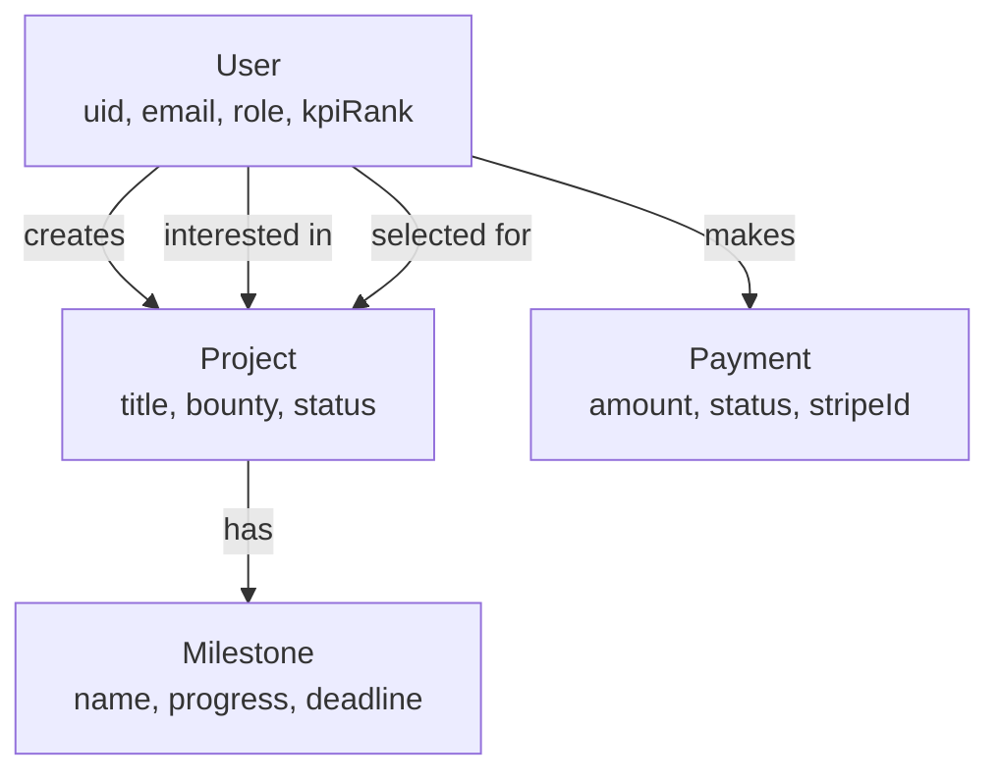
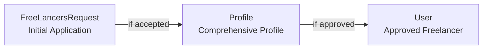
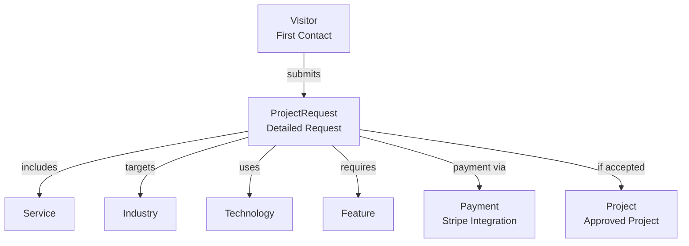
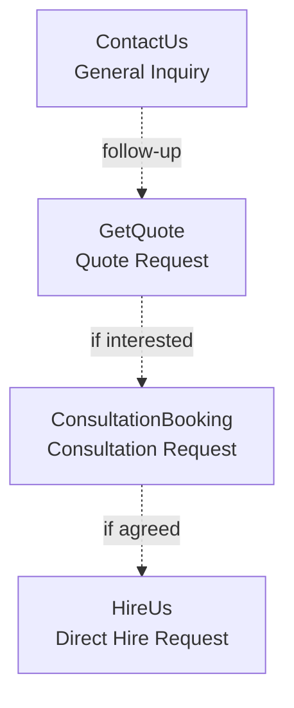
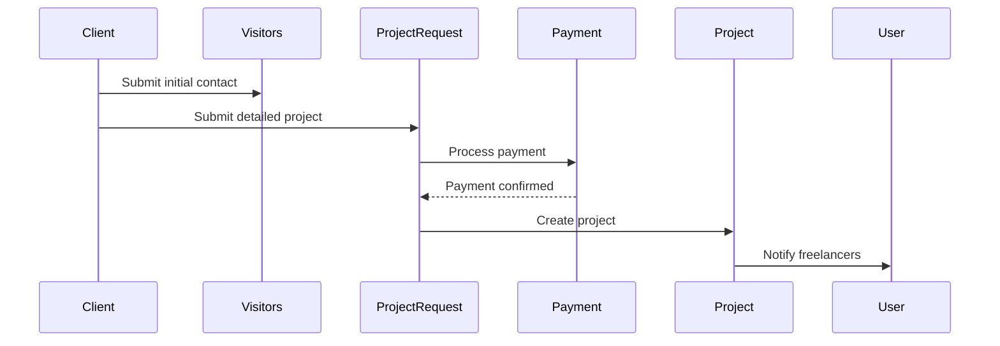
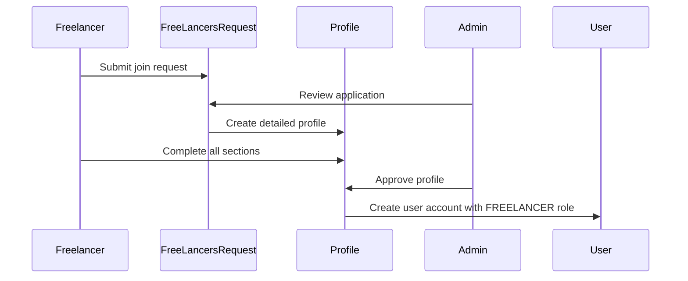
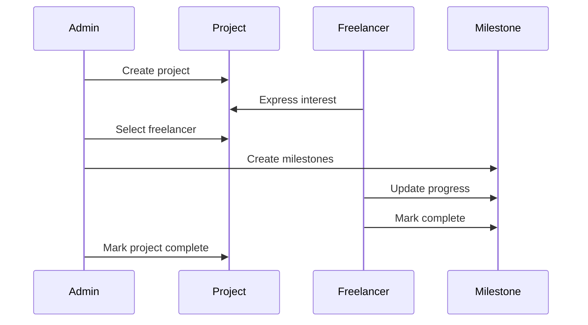

# Entity Relationship Diagram - Visual Guide

## Main ER Diagram (Complete System)

```mermaid
erDiagram
    %% Core User and Authentication
    User ||--o{ Project : "creates (clientWhoPostedThisProjectForeignId)"
    User ||--o{ ProjectRequest : "submits (userId)"
    User ||--o{ Payment : "makes (userId)"
    User }o--o{ Project : "interested_in (InterestedFreelancers)"
    User }o--o{ Project : "selected_for (SelectedFreelancers)"
    User }o--o{ ProjectBuilder : "interested_in (InterestedProjectBuilderFreelancers)"
    User }o--o{ ProjectBuilder : "selected_for (SelectedProjectBuilderFreelancers)"
    
    %% Project Management
    Project ||--o{ Milestone : "contains (projectId)"
    
    %% Project Request System
    ProjectRequest ||--o{ Service : "includes (submissionId)"
    ProjectRequest ||--o{ Industry : "targets (submissionId)"
    ProjectRequest ||--o{ Technology : "uses (submissionId)"
    ProjectRequest ||--o{ Feature : "requires (submissionId)"
    
    %% Freelancer Profile System
    Profile ||--|| WhoYouAre : "has (whoYouAreId)"
    Profile ||--|| CoreRole : "has (coreRoleId)"
    Profile ||--|| EliteSkillCards : "has (eliteSkillCardsId)"
    Profile ||--|| ToolstackProficiency : "has (toolstackProficiencyId)"
    Profile ||--|| DomainExperience : "has (domainExperienceId)"
    Profile ||--|| IndustryExperience : "has (industryExperienceId)"
    Profile ||--|| AvailabilityWorkflow : "has (availabilityWorkflowId)"
    Profile ||--|| SoftSkills : "has (softSkillsId)"
    Profile ||--|| Certifications : "has (certificationsId)"
    Profile ||--|| ProjectQuoting : "has (projectQuotingId)"
    Profile ||--|| LegalAgreements : "has (legalAgreementsId)"
    
    %% Legal System
    LegalAgreements ||--|| IdentityVerification : "includes (identityVerificationId)"
    LegalAgreements ||--|| WorkAuthorization : "includes (workAuthorizationId)"
    
    %% Navigation System
    MenuItem ||--o{ MenuItem : "parent_of (parentId)"
    
    User {
        string uid PK "Primary Key"
        string username UK "Unique"
        string email UK "Unique"
        string password "Hashed"
        enum role "CLIENT|ADMIN|MODERATOR|FREELANCER"
        string phone UK "Unique"
        string otpPassword "For verification"
        datetime emailVerifiedAt
        int tokenVersion "For JWT invalidation"
        string niche "Specialization"
        json kpi "Performance metrics"
        enum kpiRank "BRONZE to CONQUERER"
        datetime createdAt
        datetime updatedAt
        datetime trashedAt "Soft delete"
    }
    
    Project {
        int id PK
        string title UK
        string projectSlug UK
        string detail
        string niche
        int bounty "Project reward"
        datetime deadline
        int progressPercentage "0-100"
        enum difficultyLevel "EASY|MEDIUM|HARD"
        enum projectStatus "CANCELLED|PENDING|ONGOING|COMPLETED"
        enum projectType "INHOUSE|OUTSOURCE"
        string clientWhoPostedThisProjectForeignId FK
        datetime projectCompletedOn
        int starsByClientAfterProjectCompletion
        datetime createdAt
        datetime trashedAt
    }
    
    Milestone {
        int id PK
        string mileStoneName UK
        string description
        datetime deadline
        int progress "Current progress"
        int totalProgressPoints "Total points"
        int projectId FK
        int priorityRank
        boolean isMilestoneCompleted
        datetime createdAt
    }
    
    ProjectRequest {
        string id PK
        string userId FK
        string fullName
        string businessEmail
        string phoneNumber
        string companyName
        string companyWebsite
        string businessAddress
        string businessType
        string referralSource
        string stripeCheckOutUrl
        string paymentIntentId
        int appliedDiscount
        string timeline
        string paymentMethod
        int estimateFinalPriceMin
        int estimateFinalPriceMax
        boolean estimateAccepted
        boolean agreementAccepted
        boolean completed
        datetime createdAt
        datetime updatedAt
    }
    
    Service {
        string id PK
        string submissionId FK
        string category
        string service
    }
    
    Industry {
        string id PK
        string submissionId FK
        string category
        string industry
    }
    
    Technology {
        string id PK
        string submissionId FK
        string category
        string technology
    }
    
    Feature {
        string id PK
        string submissionId FK
        string category
        string feature
    }
    
    ProjectBuilder {
        string id PK
        string projectName
        string projectDescription
        string projectType
        array technologies
        array features
        int budget
        string timeline
        string priority "MEDIUM default"
        string status "DRAFT default"
        string clientName
        string clientEmail
        string clientPhone
        string clientCompany
        datetime createdAt
        datetime updatedAt
        datetime trashedAt
    }
    
    Payment {
        string id PK
        string userId FK
        string stripePaymentIntentId UK
        string stripeSessionId UK
        string stripeCustomerId
        int amount "In cents"
        string currency "Default: usd"
        enum status "PENDING|SUCCEEDED|FAILED|CANCELED|REFUNDED"
        enum paymentMethod "CARD|BANK_TRANSFER|WALLET"
        string clientEmail
        string clientName
        string clientPhone
        string description
        json metadata
        datetime paidAt
        datetime refundedAt
        datetime createdAt
        datetime updatedAt
        datetime trashedAt
    }
    
    Profile {
        string id PK
        string userId
        string whoYouAreId FK
        string coreRoleId FK
        string eliteSkillCardsId FK
        string toolstackProficiencyId FK
        string domainExperienceId FK
        string industryExperienceId FK
        string availabilityWorkflowId FK
        string softSkillsId FK
        string certificationsId FK
        string projectQuotingId FK
        string legalAgreementsId FK
        boolean isAccepted
        datetime trashedAt
    }
    
    WhoYouAre {
        string id PK
        string fullName
        string email UK
        string timeZone
        string country
        json professionalLinks
        string phone
    }
    
    CoreRole {
        string id PK
        string primaryDomain
    }
    
    EliteSkillCards {
        string id PK
        json selectedSkills
    }
    
    ToolstackProficiency {
        string id PK
        json selectedTools
    }
    
    DomainExperience {
        string id PK
        json roles
    }
    
    IndustryExperience {
        string id PK
        json selectedIndustries
    }
    
    AvailabilityWorkflow {
        string id PK
        int weeklyCommitment
        json workingHours
        json collaborationTools
        string teamStyle
        string screenSharing
        string availabilityExceptions
    }
    
    SoftSkills {
        string id PK
        string collaborationStyle
        string communicationFrequency
        string conflictResolution
        json languages
        string teamVsSolo
    }
    
    Certifications {
        string id PK
        json certificates
    }
    
    ProjectQuoting {
        string id PK
        string compensationPreference
        int smallProjectPrice
        int midProjectPrice
        int longTermPrice
        string milestoneTerms
        string willSubmitProposals
    }
    
    LegalAgreements {
        string id PK
        json agreements
        string identityVerificationId FK
        string workAuthorizationId FK
    }
    
    IdentityVerification {
        string id PK
        string idType
        string taxDocType
        boolean addressVerified
    }
    
    WorkAuthorization {
        string id PK
        boolean interested
    }
    
    ContactUs {
        int id PK
        string firstName
        string lastName
        string email
        string message
        datetime createdAt
        datetime trashedAt
    }
    
    Newsletter {
        string id PK
        string email UK
        boolean subscriptionStatus
        datetime createdAt
    }
    
    BlogPost {
        int blogId PK
        string blogTitle UK
        string blogSlug UK
        string blogThumbnail
        string blogOverview
        string blogBody
        boolean isPublished
        datetime createdAt
    }
    
    ConsultationBooking {
        int id PK
        string name
        string email
        string phone
        string message
        datetime bookingDate UK
        enum status "PENDING|ACCEPTED|REJECTED"
        string subject
        string address
        datetime createdAt
        datetime trashedAt
    }
    
    GetQuote {
        int id PK
        string name
        string email
        string phone
        string company
        string address
        string deadline
        string services
        string detail
        datetime createdAt
        datetime trashedAt
    }
    
    HireUs {
        int id PK
        string name
        string email
        string phone
        string company
        string address
        string detail
        json docs "Uploaded documents"
        datetime createdAt
        datetime trashedAt
    }
    
    FreeLancersRequest {
        int id PK
        string name
        string email UK
        string phone UK
        string address
        string detail
        string yourPortfolio
        string niche
        string yourTopProject1
        string yourTopProject2
        string yourTopProject3
        boolean isAccepted
        datetime createdAt
        datetime trashedAt
    }
    
    NichesForFreelancers {
        int id PK
        string niche
    }
    
    Visitors {
        string id PK
        string fullName
        string businessEmail UK
        string phoneNumber
        string companyName
        string companyWebsite
        string businessAddress
        string businessType
        string referralSource
        datetime createdAt
        datetime updatedAt
        datetime trashedAt
    }
    
    MenuItem {
        int id PK
        string title
        string description
        string slug UK
        string href
        string image
        int parentId FK "Self-reference"
        datetime trashedAt
    }
    
    RateLimiterFlexible {
        string key PK "IP or identifier"
        int points "Request count"
        datetime expire
    }
    
    CreateServicesForQuote {
        int id PK
        string services
    }
```



---

## Simplified Core Relationships

### User Management Flow


### Freelancer Registration Flow


### Project Request Flow


### Business Inquiry Flow


---

## Database Access Patterns

### By User Role

#### CLIENT (Regular User)
- Can create ProjectRequest
- Can view own projects
- Can make payments
- Can rate and review completed projects

#### FREELANCER
- Can view available projects
- Can express interest in projects
- Can be selected for projects
- Can update milestone progress
- Can view payments for their projects

#### MODERATOR
- Can manage most resources
- Can accept/reject freelancer applications
- Can manage projects
- Cannot permanently delete (requires ADMIN)

#### ADMIN
- Full access to all resources
- Can permanently delete
- Can manage user roles
- Can access trash/deleted items

---

## Data Flow Diagrams

### New Client Onboarding


### Freelancer Onboarding


### Project Assignment Flow


---

## Key Design Patterns

### 1. Soft Delete Pattern
Almost all tables implement soft delete:
```sql
trashedBy: String?
trashedAt: DateTime?
```
Benefits:
- Data recovery capability
- Audit trail
- Compliance with data retention policies

### 2. Timestamp Pattern
Most tables track creation and updates:
```sql
createdAt: DateTime @default(now())
updatedAt: DateTime @updatedAt
```

### 3. Many-to-Many with Implicit Junction Tables
Prisma creates implicit junction tables for:
- User ↔ Project (interested freelancers)
- User ↔ Project (selected freelancers)
- User ↔ ProjectBuilder (interested/selected)

### 4. Composite Profile Pattern
Freelancer Profile is split into 11 separate tables:
- Reduces table bloat
- Allows independent updates
- Better normalization
- Flexible schema evolution

### 5. Enumeration Pattern
Uses enums for constrained values:
- Role, ProjectStatus, PaymentStatus, etc.
- Type safety at database level
- Clear domain logic

---

## Performance Considerations

### Heavily Indexed Tables
1. **User**: 7 indexes (uid, username, email, role, etc.)
2. **Project**: 9 indexes (id, title, status, deadline, etc.)
3. **Milestone**: 7 indexes
4. **Payment**: 8 indexes

### JSON Fields for Flexibility
Used for:
- Variable-length arrays (skills, tools, certificates)
- Nested data (professional links, metadata)
- Dynamic configuration

### Cascade Deletes
Only used for:
- Milestone → Project (when project deleted, milestones auto-delete)
- MenuItem → MenuItem (parent-child hierarchy)

---

## Schema Evolution Notes

### Version 1 Tables (Auto-increment IDs)
- User (uid is cuid)
- Project
- Milestone
- ContactUs
- GetQuote
- ConsultationBooking
- HireUs
- FreeLancersRequest
- BlogPost

### Version 2 Tables (UUID)
- ProjectRequest
- ProjectBuilder
- Visitors
- Payment
- Profile subsystem

This shows evolution from integer IDs to UUIDs for:
- Better distributed systems support
- No ID collision in microservices
- Better security (non-guessable IDs)

---

## Summary Statistics

| Metric | Count |
|--------|-------|
| Total Tables | 33 |
| Total Enums | 8 |
| One-to-One Relations | 11 |
| One-to-Many Relations | 15+ |
| Many-to-Many Relations | 4 |
| Tables with Soft Delete | 18 |
| Tables with JSON Fields | 13 |
| Tables with Unique Constraints | 25+ |
| Total Indexes | 100+ |


