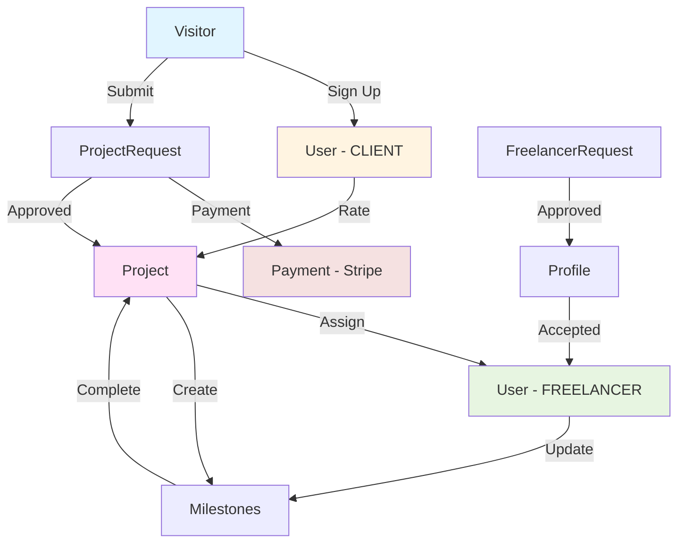

# Project Overview & Architecture

Complete overview of the backend project with all its components, APIs, and database structure.

---

## 📊 Project Statistics

### API Layer
- **Total API Modules**: 17
- **Total Endpoints**: 150+
- **Base URL**: `/api/v1`
- **Authentication**: JWT-based
- **Rate Limiting**: Implemented on critical endpoints

### Database Layer
- **Database Type**: PostgreSQL
- **ORM**: Prisma
- **Total Tables**: 33
- **Total Enums**: 8
- **Relationships**: 30+ (One-to-One, One-to-Many, Many-to-Many)

### Technology Stack
- **Runtime**: Node.js
- **Language**: TypeScript
- **Framework**: Express.js
- **ORM**: Prisma
- **Database**: PostgreSQL
- **Payment**: Stripe Integration
- **Email**: Custom email service
- **File Upload**: Multer
- **Validation**: Zod schemas

---

## 🏗️ System Architecture

```
┌─────────────────────────────────────────────────────────────┐
│                         CLIENT LAYER                         │
│                    (Frontend Applications)                    │
└───────────────────────────┬─────────────────────────────────┘
                            │
                            │ HTTP/HTTPS
                            │
┌───────────────────────────▼─────────────────────────────────┐
│                      API GATEWAY LAYER                        │
│                     Base: /api/v1                            │
│  ┌────────────────────────────────────────────────────────┐ │
│  │  • Rate Limiting      • CORS                            │ │
│  │  • Authentication     • Validation                      │ │
│  │  • Error Handling     • Logging                         │ │
│  └────────────────────────────────────────────────────────┘ │
└───────────────────────────┬─────────────────────────────────┘
                            │
        ┌───────────────────┼───────────────────┐
        │                   │                   │
┌───────▼────────┐  ┌──────▼──────┐  ┌────────▼────────┐
│   ROUTERS (18)  │  │ CONTROLLERS  │  │  MIDDLEWARES (5) │
│                 │  │    (28)      │  │                  │
│ • Auth          │  │              │  │ • Auth Check     │
│ • Projects      │  │              │  │ • Role Check     │
│ • Payments      │  │              │  │ • Validation     │
│ • Freelancer    │  │              │  │ • Rate Limit     │
│ • etc...        │  │              │  │ • Error Handler  │
└───────┬─────────┘  └──────┬───────┘  └────────┬─────────┘
        │                   │                   │
        └───────────────────┼───────────────────┘
                            │
                   ┌────────▼────────┐
                   │   SERVICES (13)  │
                   │                  │
                   │ • Mail Service   │
                   │ • Auth Service   │
                   │ • Payment Service│
                   │ • etc...         │
                   └────────┬─────────┘
                            │
                   ┌────────▼────────┐
                   │   UTILS (14)     │
                   │                  │
                   │ • Helpers        │
                   │ • Validators     │
                   │ • Formatters     │
                   └────────┬─────────┘
                            │
        ┌───────────────────┼───────────────────┐
        │                   │                   │
┌───────▼────────┐  ┌──────▼──────┐  ┌────────▼────────┐
│  PRISMA ORM    │  │   STRIPE    │  │   EMAIL/FILES   │
│                │  │     API     │  │                 │
└───────┬────────┘  └─────────────┘  └─────────────────┘
        │
┌───────▼────────────────────────────────────────────────┐
│              POSTGRESQL DATABASE                        │
│                  (33 Tables)                           │
└────────────────────────────────────────────────────────┘
```

---

## 🔐 User Roles & Permissions

### CLIENT (Default)
**Can:**
- Register and login
- Create project requests
- View own projects
- Make payments
- Rate completed projects
- Contact support

**Cannot:**
- Access admin functions
- View other users' data
- Manage freelancers

### FREELANCER
**Can:**
- All CLIENT permissions
- View available projects
- Express interest in projects
- Update milestone progress
- View payment information
- Manage own profile

**Cannot:**
- Create projects
- Select freelancers
- Access admin functions

### MODERATOR
**Can:**
- All FREELANCER permissions
- Manage projects
- Accept/reject applications
- View all users
- Manage content (blogs, quotes, etc.)
- Soft delete resources

**Cannot:**
- Permanently delete
- Change user roles (admin only)
- Access financial reports

### ADMIN
**Can:**
- Everything
- Permanently delete
- Manage user roles
- Access trash/deleted items
- View all financial data
- System configuration

---

## 🗄️ Database Schema Overview

### Core Business Flow



### Table Categories

#### 👥 User Management (3)
- User
- Newsletter  
- RateLimiterFlexible

#### 💼 Project System (3)
- Project
- Milestone
- ProjectBuilder

#### 📝 Business Intake (6)
- ProjectRequest + Service/Industry/Technology/Feature
- Visitors

#### 💬 Communication (4)
- ContactUs
- GetQuote
- ConsultationBooking
- HireUs

#### 👨‍💻 Freelancer Profiles (14)
- FreeLancersRequest
- NichesForFreelancers
- Profile + 11 sub-tables

#### 💳 Financial (1)
- Payment

#### 📰 Content (2)
- BlogPost
- MenuItem

---

## 📡 API Modules Breakdown

### 1️⃣ **Authentication & Users** (`/api/v1/auth`)
**24 endpoints** | Role management, JWT tokens, OTP verification

Key Features:
- User registration with email verification
- Login/Logout with JWT tokens
- Password reset flow
- Role-based access control
- User profile management
- Force logout from all devices

### 2️⃣ **Projects** (`/api/v1/project`)
**17 endpoints** | Project management, freelancer assignment

Key Features:
- Create and manage projects
- Assign freelancers
- Track progress
- Client reviews and ratings
- Outsource management

### 3️⃣ **Milestones** (`/api/v1/milestone`)
**6 endpoints** | Project milestone tracking

Key Features:
- Create single or multiple milestones
- Track progress per milestone
- Mark milestones complete
- Priority ranking

### 4️⃣ **Freelancer** (`/api/v1/freelancer`)
**27 endpoints** | Freelancer onboarding and management

Key Features:
- Join requests (V1 & V2)
- Comprehensive registration
- Niche management
- Profile listing
- Accept/reject applications

### 5️⃣ **Payments** (`/api/v1/payment`)
**7 endpoints** | Stripe payment integration

Key Features:
- Payment intents
- Checkout sessions
- Webhook handling
- Refunds
- Payment history

### 6️⃣ **Project Request** (`/api/v1/projectRequest`)
**4 endpoints** | Detailed project submissions

Key Features:
- Complete project intake form
- Service/Industry/Tech selection
- Pricing estimates
- Agreement acceptance

### 7️⃣ **Project Builder** (`/api/v1/project-builder`)
**10 endpoints** | Project planning tool

Key Features:
- Project planning
- Freelancer selection
- Budget and timeline management

### 8️⃣ **Contact & Communication**
- **Contact Us** (`/api/v1/contactUs`) - 7 endpoints
- **Get Quote** (`/api/v1/getQuotes`) - 8 endpoints
- **Consultation** (`/api/v1/consultation`) - 9 endpoints
- **Hire Us** (`/api/v1/hireUs`) - 6 endpoints

### 9️⃣ **Content Management**
- **Blog** (`/api/v1/blog`) - 7 endpoints
- **Navigation Pages** (`/api/v1/navigationPages`) - 8 endpoints

### 🔟 **Supporting Modules**
- **Newsletter** (`/api/v1/newsletter`) - 5 endpoints
- **Visitors** (`/api/v1/visitors`) - 6 endpoints
- **Trash** (`/api/v1/trash`) - 7 endpoints
- **Health** (`/api/v1/health`) - 1 endpoint

---

## 🔄 Key Business Workflows

### Workflow 1: New Client Project
```
1. Visitor lands → Visitors table
2. Submit contact → ContactUs table
3. Request quote → GetQuote table
4. Book consultation → ConsultationBooking table
5. Submit project → ProjectRequest table
6. Process payment → Payment table (Stripe)
7. Create project → Project table
8. Notify freelancers
9. Freelancer interest → Project.interestedFreelancers
10. Admin selects → Project.selectedFreelancers
11. Create milestones → Milestone table
12. Track progress
13. Complete project
14. Client reviews → Project rating/comment
```

### Workflow 2: Freelancer Onboarding
```
1. Submit join request → FreeLancersRequest
2. Admin reviews
3. If interested → Create Profile
4. Complete all 11 profile sections:
   - WhoYouAre
   - CoreRole
   - EliteSkillCards
   - ToolstackProficiency
   - DomainExperience
   - IndustryExperience
   - AvailabilityWorkflow
   - SoftSkills
   - Certifications
   - ProjectQuoting
   - LegalAgreements (with verification)
5. Admin approves → Create User with FREELANCER role
6. Freelancer can now view and bid on projects
```

### Workflow 3: Project Execution
```
1. Project created → Project.status = PENDING
2. Freelancers express interest
3. Admin selects freelancer → Project.status = ONGOING
4. Admin creates milestones
5. Freelancer updates progress
6. Each milestone tracked individually
7. All milestones complete → Project.progressPercentage = 100
8. Admin marks complete → Project.status = COMPLETED
9. Client rates and reviews
10. Payment processed
```

---

## 🛡️ Security Features

### Authentication
- ✅ JWT-based authentication
- ✅ Refresh token mechanism
- ✅ Token versioning (force logout)
- ✅ OTP verification for email
- ✅ Password hashing (bcrypt implied)

### Authorization
- ✅ Role-based access control (4 roles)
- ✅ Endpoint-level permissions
- ✅ Resource-level permissions

### Rate Limiting
- ✅ IP-based rate limiting
- ✅ Flexible rate limits per endpoint
- ✅ Configurable time windows
- ✅ Stored in database (RateLimiterFlexible)

### Data Protection
- ✅ Soft delete (18 tables)
- ✅ Audit trails (trashedBy, trashedAt)
- ✅ Unique constraints on sensitive fields
- ✅ Input validation (Zod schemas)

### Payment Security
- ✅ Stripe integration (PCI compliant)
- ✅ Webhook signature verification
- ✅ Secure payment intent flow

---

## 📊 Performance Optimizations

### Database Indexes
- **100+** indexes across 33 tables
- Indexed on frequently queried fields:
  - Primary keys (all tables)
  - Foreign keys (all relations)
  - Email fields (12 tables)
  - Status fields (16 tables)
  - Timestamp fields (all tables with dates)
  - Search fields (blogBody, message)

### Query Optimization
- Selective field retrieval
- Proper use of relations
- Cascade deletes (only where needed)
- Efficient many-to-many (implicit junction tables)

### Caching Strategy
- Rate limiter uses database cache
- JWT tokens reduce database hits

---

## 🔗 External Integrations

### Stripe Payment Gateway
**Integration Points:**
- Payment intents for server-side
- Checkout sessions for client-side
- Webhooks for real-time updates
- Refund processing
- Customer management

**Database Fields:**
- stripePaymentIntentId
- stripeSessionId
- stripeCustomerId

### Email Service
**Capabilities:**
- OTP verification emails
- Welcome emails
- Newsletter
- Admin notifications
- Custom templates (7 HTML templates)

### File Upload
**Implementation:**
- Multer middleware
- Used in HireUs endpoint
- Stored as JSON array

---

## 📈 Scalability Considerations

### Database
- PostgreSQL (proven for large-scale)
- Proper indexing strategy
- JSON fields for flexibility
- UUID for distributed systems
- Connection pooling (Prisma)

### Application
- Stateless API (JWT tokens)
- Horizontal scaling ready
- Rate limiting prevents abuse
- Modular architecture

### Future Enhancements
- Add caching layer (Redis)
- Implement message queue
- Add search engine (Elasticsearch)
- Implement CDN for static assets

---

## 📝 API Design Patterns

### RESTful Conventions
- ✅ Resource-based URLs
- ✅ HTTP verbs (GET, POST, PUT, PATCH, DELETE)
- ✅ Status codes (200, 201, 400, 401, 403, 404, 500)
- ✅ Consistent response format

### Endpoint Patterns
```
GET    /resource           → List all
GET    /resource/:id       → Get single
POST   /resource           → Create
PUT    /resource/:id       → Full update
PATCH  /resource/:id       → Partial update
DELETE /resource/:id       → Delete
```

### Special Endpoints
```
POST   /resource/:id/action    → Perform action
PATCH  /resource/trash         → Move to trash
PATCH  /resource/untrash       → Restore
GET    /trash/resource         → List trashed
```

---

## 🧪 Quality Assurance

### Validation
- **Zod schemas** for request validation
- Type safety (TypeScript)
- Enum constraints (database level)
- Unique constraints
- Required field validation

### Error Handling
- Centralized error middleware
- Custom error responses
- Detailed error messages (dev)
- Safe error messages (prod)
- Not found handler

### Testing
- Auth tests exist (`tests/authentication/`)
- OTP integration tests
- Project builder tests
- Complete workflow tests

---

## 📁 Project Structure

```
src/
├── app.ts                    # Main app setup
├── server.ts                 # Server initialization
├── config/
│   └── config.ts            # Configuration
├── constants/
│   ├── emailResponses.ts    # Email templates
│   ├── endpoint.ts          # Route constants
│   └── index.ts
├── controllers/ (28 files)  # Business logic
│   ├── authController/
│   ├── projectController/
│   ├── paymentController/
│   └── ...
├── database/
│   └── db.ts                # Prisma client
├── middlewares/ (5 files)
│   ├── authMiddleware.ts    # Auth checks
│   ├── validationMiddleware.ts
│   ├── rateLimiterMiddleware.ts
│   ├── errorMiddleware.ts
│   └── multerMiddleware.ts
├── routers/ (18 files)      # Route definitions
│   ├── authRouter/
│   ├── projectRouter/
│   └── ...
├── services/ (13 files)     # Reusable services
│   ├── globalMailService.ts
│   └── ...
├── utils/ (14 files)        # Helper functions
├── validation/
│   └── zod.ts               # Zod schemas
├── templates/ (7 HTML)      # Email templates
└── types/
    └── index.d.ts           # TypeScript types
```

---

## 📚 Documentation Files

| File | Purpose |
|------|---------|
| `API_ENDPOINTS_DOCUMENTATION.md` | Complete API reference with all 150+ endpoints |
| `DATABASE_SCHEMA_DOCUMENTATION.md` | Detailed database schema with all 33 tables |
| `ER_DIAGRAM.md` | Visual ER diagrams and data flow |
| `DATABASE_QUICK_REFERENCE.md` | Quick lookup for tables and relationships |
| `PROJECT_OVERVIEW.md` | This file - Complete project overview |

---

## 🚀 Getting Started

### Prerequisites
```bash
- Node.js (v16+)
- PostgreSQL
- npm or yarn
- Stripe account (for payments)
```

### Key Environment Variables
```env
DATABASE_URL="postgresql://..."
JWT_SECRET="..."
STRIPE_SECRET_KEY="..."
STRIPE_WEBHOOK_SECRET="..."
EMAIL_SERVICE_CONFIG="..."
```

### Database Setup
```bash
# Install dependencies
npm install

# Generate Prisma client
npx prisma generate

# Run migrations
npx prisma migrate deploy

# Seed database (if needed)
npx prisma db seed
```

---

## 💡 Best Practices Implemented

1. ✅ **Separation of Concerns**: Routes → Controllers → Services → Database
2. ✅ **DRY Principle**: Reusable services and utilities
3. ✅ **Type Safety**: TypeScript throughout
4. ✅ **Validation**: Zod schemas for all inputs
5. ✅ **Error Handling**: Centralized error middleware
6. ✅ **Security**: JWT auth, rate limiting, input validation
7. ✅ **Soft Deletes**: Data recovery capability
8. ✅ **Audit Trails**: Created/updated timestamps, trash tracking
9. ✅ **Scalability**: Stateless design, proper indexing
10. ✅ **Documentation**: Comprehensive API and database docs

---

## 🎯 Key Metrics Summary

| Metric | Count |
|--------|-------|
| API Endpoints | 150+ |
| Database Tables | 33 |
| Enumerations | 8 |
| Controllers | 28 |
| Routers | 18 |
| Services | 13 |
| Utilities | 14 |
| Middlewares | 5 |
| Email Templates | 7 |
| User Roles | 4 |
| Payment Methods | 3 |
| Project Statuses | 4 |

---

## 🏆 Project Highlights

- **Comprehensive System**: Covers entire freelance marketplace lifecycle
- **Production Ready**: Includes auth, payments, rate limiting, error handling
- **Scalable Architecture**: Modular design ready for growth
- **Well Documented**: 5 comprehensive documentation files
- **Type Safe**: Full TypeScript implementation
- **Secure**: Multiple security layers implemented
- **Flexible**: JSON fields and enums allow easy extension
- **Professional**: Follows industry best practices

---

*Last Updated: October 10, 2025*

